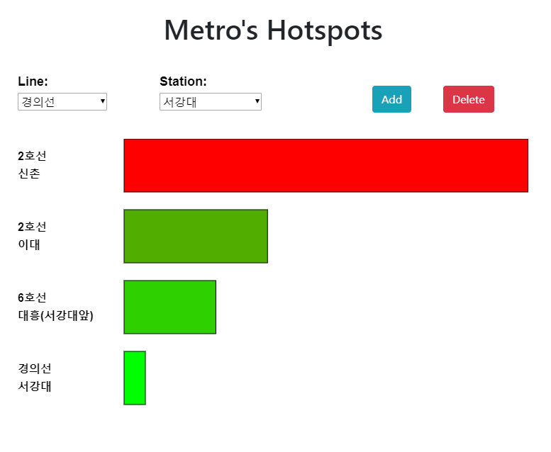

# Project 10 - Data Visualization

[Web preview](https://editor.p5js.org/kimih12/full/YSutAjwqB)
([https://editor.p5js.org/kimih12/full/YSutAjwqB](https://editor.p5js.org/kimih12/full/YSutAjwqB))

[Code](https://editor.p5js.org/kimih12/sketches/YSutAjwqB)

## Student information

---

- Name: Inho Kim
- Major: Computer Science and Engineering
- ID: 20161577

## Application design

---

### Title

> Metro's Hotspots

### Target users

This application would serve as something helpful for people who are interested in analyzing the Seoul Metropolitan Subway System.

### Features

- Any station

You may choose any station from any line that exist within the Seoul Metropolitan Subway System.
Use the selection dropdowns to add your selection. Press the 'Add' button to include the selected station into the comparison and 'Delete' button to exlucde the station data at the very bottom of the list.

- Size and color scale

The data is based on a daily cumulation of total incoming passengers at each station. There are two visualizations of the data: size and color. The more incoming passengers at a certain station, the bigger and more red becomes the shape representing it.

### Visual concepts

Data visualization has to be easy to interpret, simple, yet showing an abundance of data. The shape and color variation gives a very quick insight into how crowded a station is.

### Algorithm

