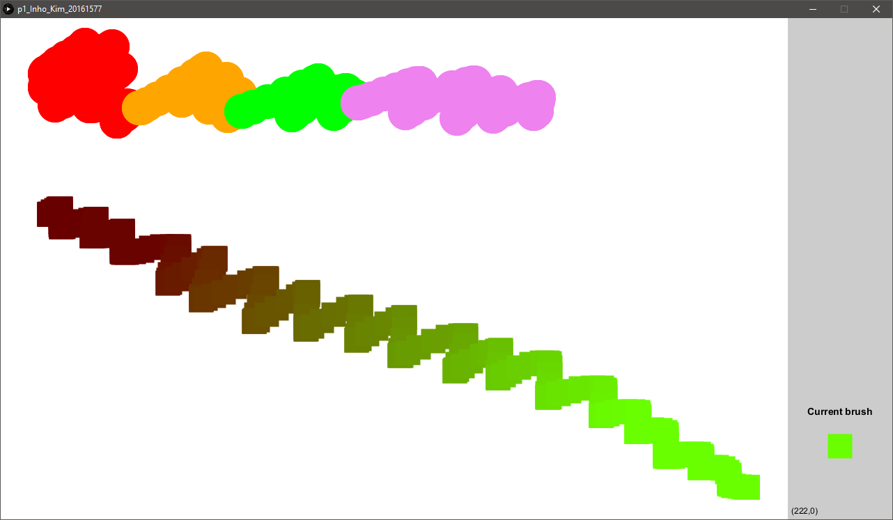
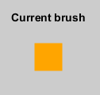
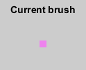
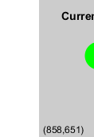
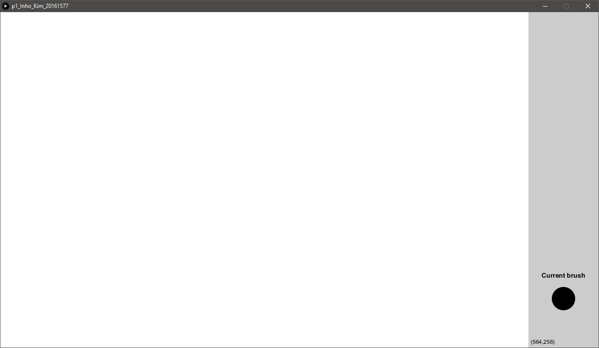
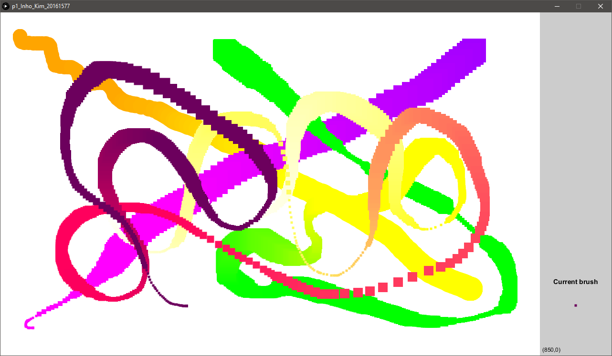

# Project 1 - New Painting App

## Student information

---

- Name: Inho Kim
- Major: Computer Science and Engineering
- ID: 20161577

## Application design

---

### Title

> Magic brush

### Target users

This painting app is created for users who want to keep their virtual canvas simple, but have all the essential functionalities included. The simple UI of the virtual canvas will allow the users to have a better visualization of their works, since it will be free of any buttons and have minimal on-screen objects.

### Features

- Color selection

Before anything, it is important to keep in mind that this painting application's color pallette is based on the RGB channels. **To adjust each of the channels, use the keys `r`, `R`, `g`, `G`, `b` and `B`.**

For instance, in order to adjust the R-channel, use **`r` to lower this channel's value and `R` to increase**. The same goes for the G-channel and the B-channel. The resulting color from the combination of the 3 channels is shown at the bottom of the side bar.

Additionally, there are some pre-defined colors to avoid wasting time adjusting channel by channel. **Pressing the number keys of the keyboard will set the brush's color to the mapped pre-defined colors.** 1 is red, 2 is orange, 3 is yellow, 4 is green, 5 is blue, 6 is indigo, 7 is violet, 8 is gray, 9 is white and 0 is black.

- Size change

The brush's size can be changed using the mouse's wheel. **Scrolling upwards will increase the brush's size, and scrolling downwards will decrease it.** Similar to the color change, the resulting brush is shown on the side bar.

- Shape change

There are two types of brush shapes in the application- circle and square. **Use the spacebar to trigger the shape change.** The resulting brush is shown in the side bar.

- Mouse coordinate

The user might need to do some precise paintings. In this case, knowing the cursor's coordinate on the canvas might be useful. It is shown at the bottom of the side bar.

- Clearing the canvas

Sometimes the user might feel like starting from scratch. The user could choose to wipe out everything using a white brush, but why do such tedious thing? **Just press the `DEL` key** and check out the magic that occured.

- Extendability

The code of this application was written in such way that a new feature can easily be added. For instance, adding a new key mapping would only require adding the new key into the array of used keys and write the `if()` clause for the mapping in a function.

### Visual concepts

The main visual focus for this application is to minimize on-screen interactions. The resulting screen might seem too empty; however, all the features mentioned above are pretty well implemented while keeping the visual factors as simple as possible.

The only big on-screen information is the preview of the brush's current state. All the changes we trigger to the brush can be seen in the preview in real time.

### Algorithm

All the algorithm implemented in this application rely on the Processing's core life cycle.

Everything starts from the `setup()` callback. During this step, all the initialization and configuration takes place such as the window's size, variable initialization, etc. After that, the `draw()` callback is constantly called through which different events, such as keyboard or mouse, are handled and draw the frame based on the given information.

When a keyboard event is detected, the application will have to first determine which key triggered it. It will then execute the associated function or make appropriate changes to the local variables. Similarly, a mouse event will also trigger the associated functions.

With the given changes, the frame has to be drawn. For instance, an update on the brush's state would mean the previous preview has to be erased, and the new preview needs to be drawn instead. Or, if a mouse click event was triggered, the appropriate shape based on the brush's current state will have to be drawn on the canvas.

In addition, the sidebar is re-drawn every time a shape is drawn on the canvas. This is necessary to erase any shape drawn on top of the side bar.
