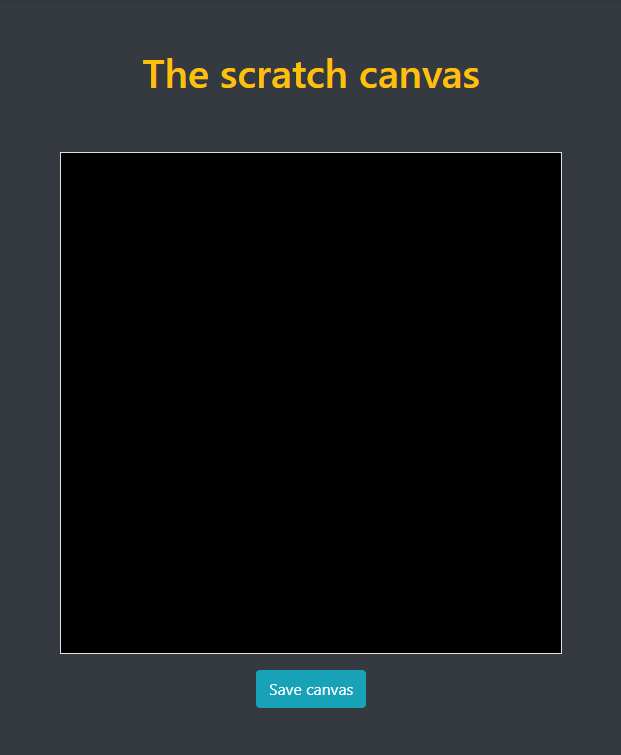
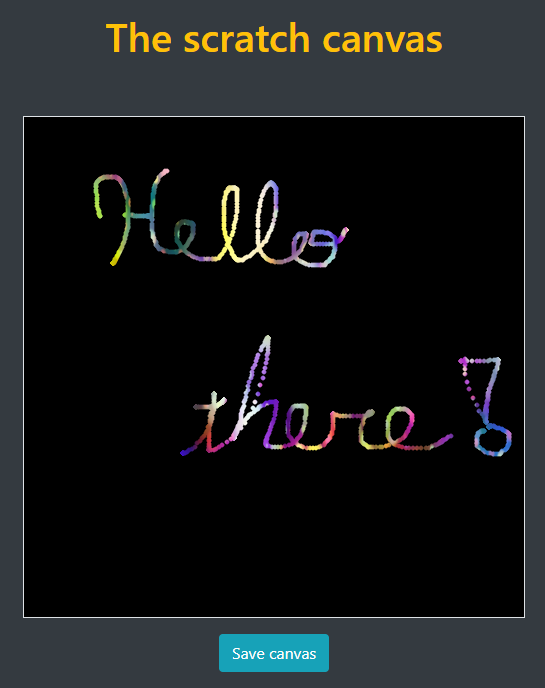
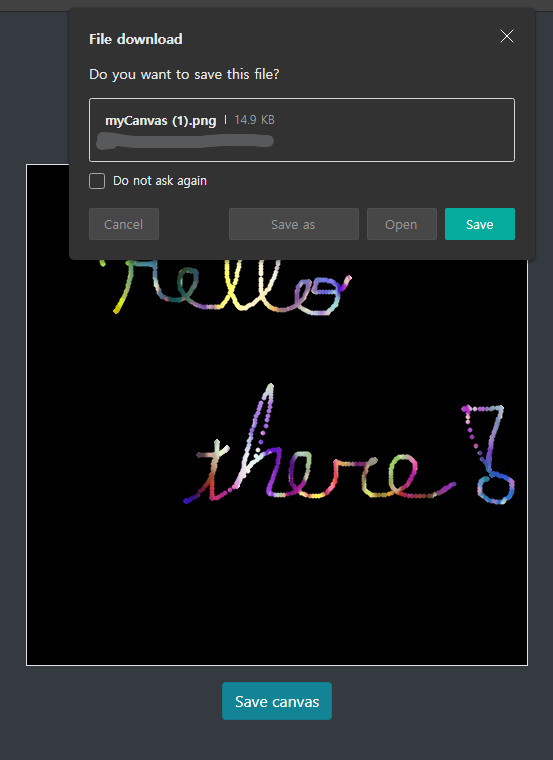
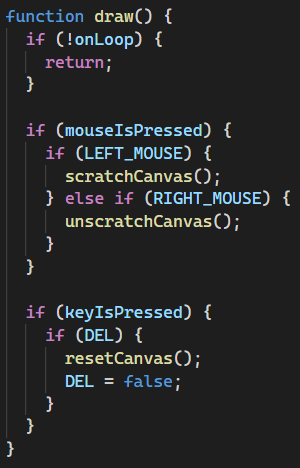
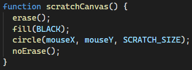
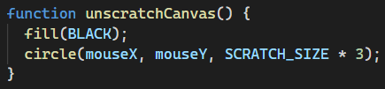

# Project 2 - New Painting Web App

[Web preview](https://editor.p5js.org/kimih12/present/BAABnB-_3)

## Student information

---

- Name: Inho Kim
- Major: Computer Science and Engineering
- ID: 20161577

## Application design

---

### Title

> The scratch canvas

### Target users

One of the most famous drawing tools for children is the scratch paper. It consists of a colored paper coverd with a black layer, and you can draw by scratching out the black layer with some tools.

I wanted to make a similar drawing tool available on a browser using the `p5.js` library, so that children can enjoy it whenever they want to!

### Features

- Easy mouse interaction

Using the left click, you can scratch out the black canvas to draw. With a right click, you can re-fill the scratched out areas with black color.

- Save canvas

After finishing the drawing, you can easily save your work as an PNG file.

- Clearing the canvas

Use the `DELETE` key to reset the canvas, which makes the whole canvas black.

### Visual concepts

Since most of the painting tools are drawings on top of a canvas, some may consider painting as a tedious work. It involves changing the color very oftenly, and sometimes we just want to create something simple but colorful and fun.

Simple but colorful is exactly what this application does. Clicking and moving the mouse is all you have to do in order to scratch out the black layer and uncover the colorful background behind it.

### Algorithm

This painting app takes advatage of the HTML. The image at the background is rendered behind the `p5.js`'s canvas. When we do a left click on the canvas, a small circle will be drawn, but the `erase()` function is called beforehand. This function makes the following drawing function calls to substract from the canvas.

Once the above `circle()` is substracted from the canvas, it will reveal the content behind the canvas, whatever is rendered in HTML. In the case of this app, the colorful background is revealed.

Doing a right click will draw the `circle()` without calling the `erase()` function beforehand.

Finally, pressing the `DELETE` key will simply reset the canvas by using the `background()` function.
