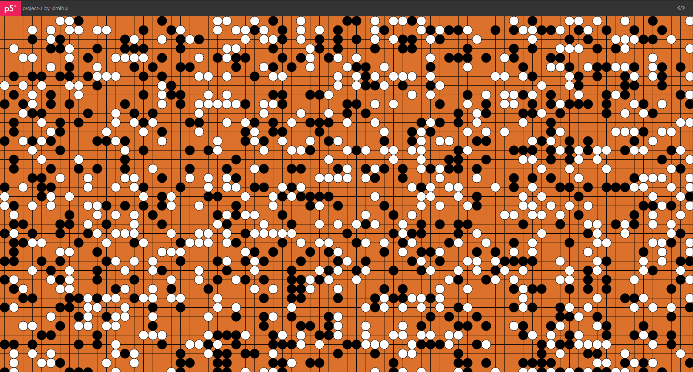
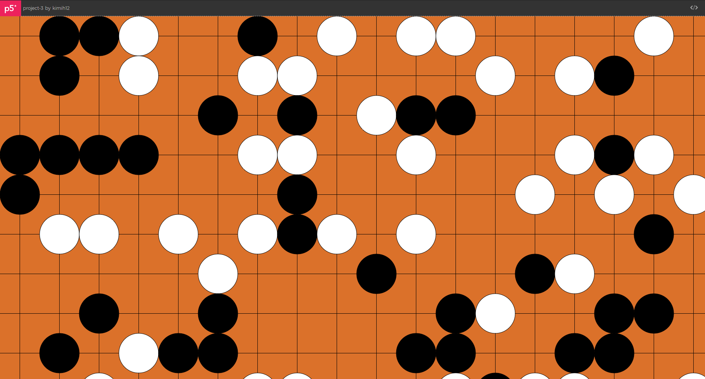
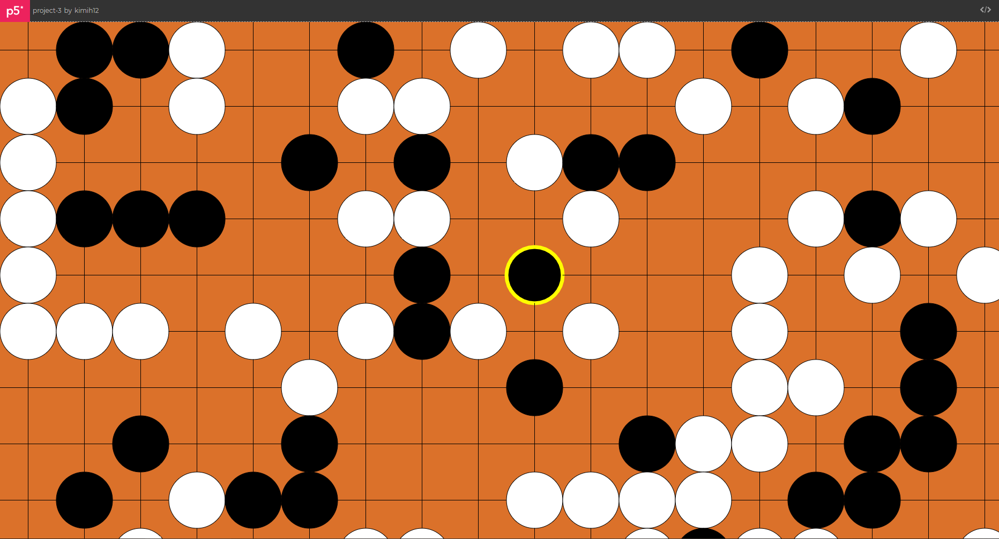
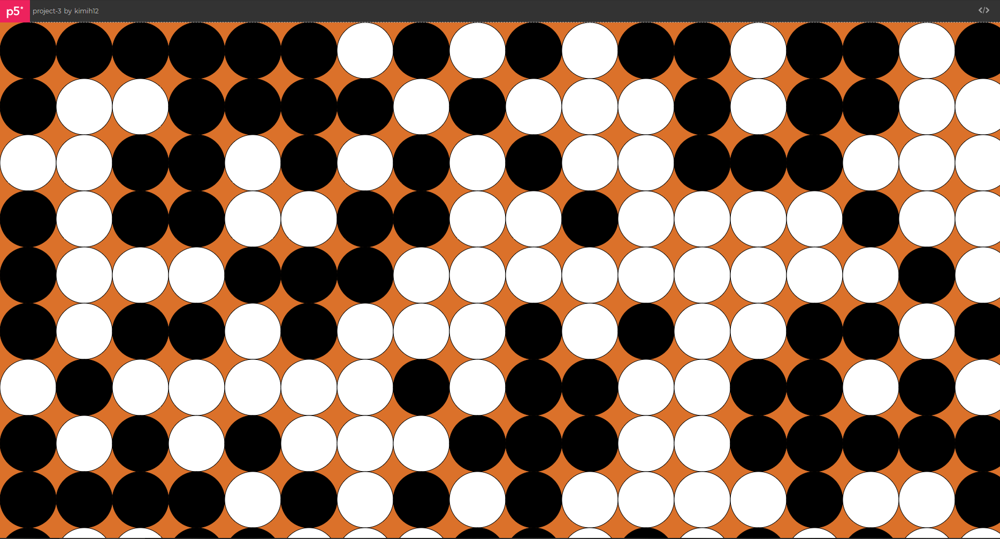
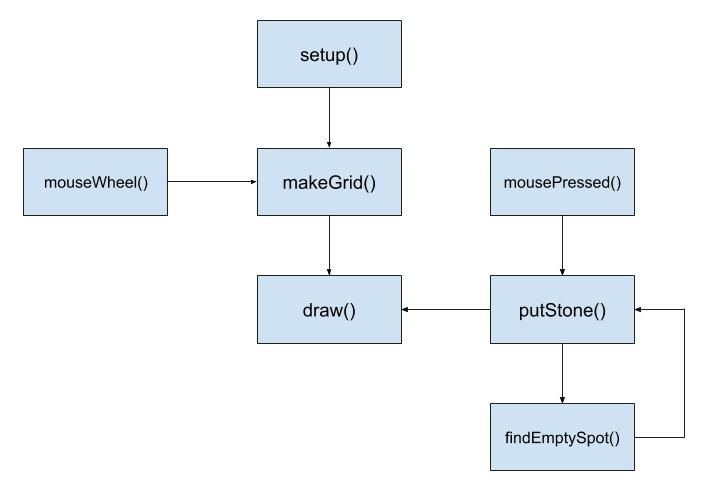

# Project 3 - Interactive 2D Pattern

[Web preview](https://editor.p5js.org/kimih12/full/y1r7tN_bc)
([https://editor.p5js.org/kimih12/full/y1r7tN_bc](https://editor.p5js.org/kimih12/full/y1r7tN_bc))

## Student information

---

- Name: Inho Kim
- Major: Computer Science and Engineering
- ID: 20161577

## Application design

---

### Title

> Reversi

### Target users

It would be interesting to have this 2D pattern for people with a portfolio related to the gaming industry.

### Features

- Grid size option

Scroll in order to adjust the grid's size.

- Play the game

If features a very naïve implementation of human VS computer game of Reversi. The user gets to play the white stones, and the computer will play the black stones. Do a click with the mouse's wheel to place the stone. The computer will do its turn after a second. The latest stone placed by the computer is highlighted with a thick yellow stroke around it.

### Visual concepts

This pattern creation was inspired by the game of Go. A completed game of Go always seemed to be an interesting pattern for me, so I wanted to create a similar randomized pattern. And to add some interactivity, I implemented a simple computer player.

### Algorithm

In its initial state after `setup()`, the `makeGrid()` will generate the new grid with the initial grid size. Then the `draw()` function will take care of drawing on canvas according the the content of the grid.

When a mouse wheel event is detected, the `mouseWheel()` function will catch it. According to the direction of scroll, the grid's size will be modified. The new grid with the changed grid size will be generated by the `makeGrid()` function.

When a click with the mouse's wheel is detected, `mousePressed()` function will catch it. This will place the white stone where the mouse is located using the `putStone()` function. Within the `putStone()` function, there will be a recursion if any empty spot is found using the `findEmptySpot()` function. Finally, the `draw()` function will render the canvas with all the changes that occured.
