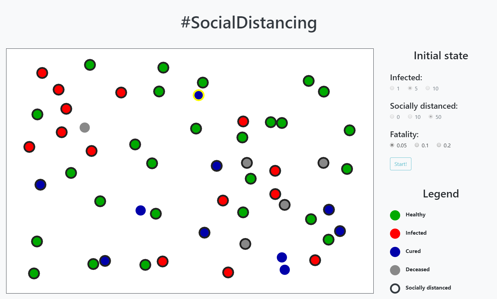
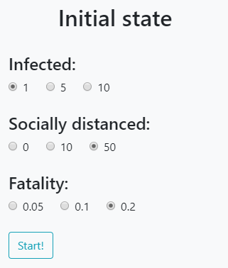
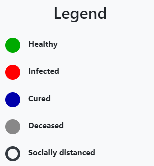
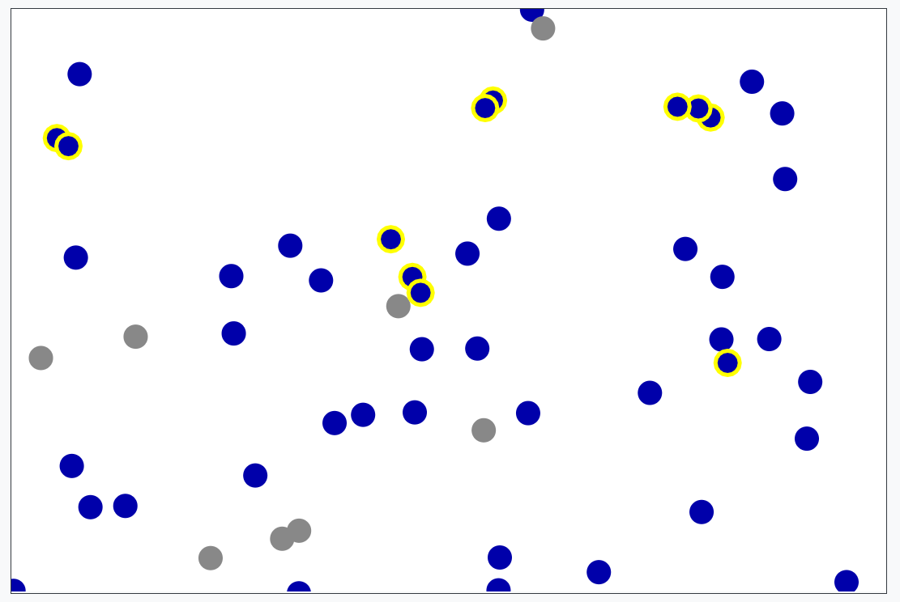
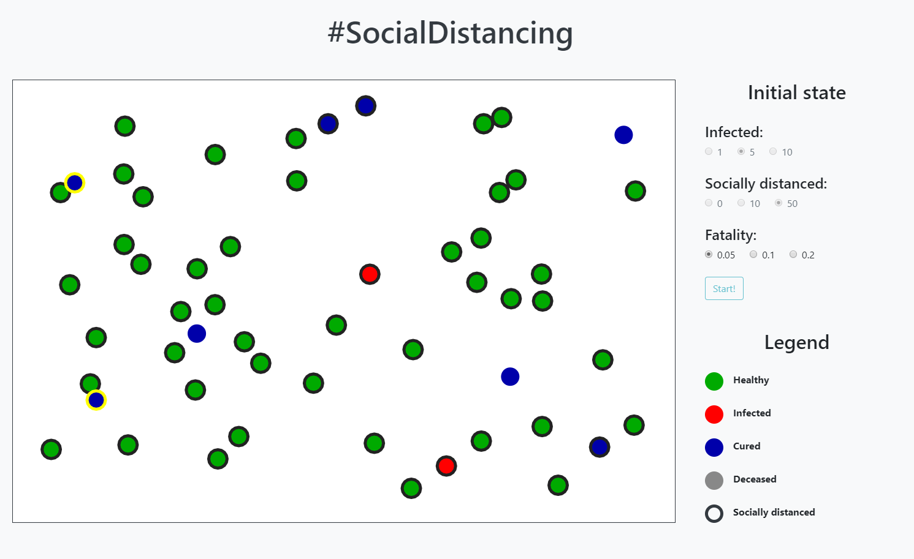
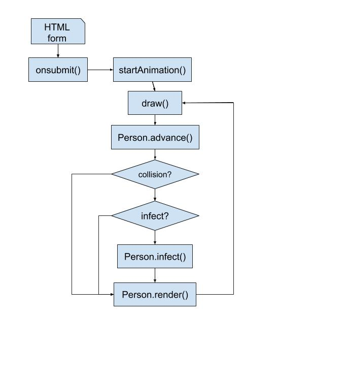

# Project 4 - Thousands of X

[Web preview](https://editor.p5js.org/kimih12/full/mL7kyBXrZ)
([https://editor.p5js.org/kimih12/full/mL7kyBXrZ](https://editor.p5js.org/kimih12/full/mL7kyBXrZ))

## Student information

---

- Name: Inho Kim
- Major: Computer Science and Engineering
- ID: 20161577

## Application design

---

### Title

> #SocialDistancing

### Target users

This application is useful for anybody who wondered how effective is the social distancing against the COVID-19 pandemic.

### Features

- Set initial state for simulation

You may choose among various options of initial state before starting the simulation.

- Legends for the simulation

The meaning of each symbol present in the simulation is shown as above.

- The simulation

The simulation is easy to understand. Whenever two people contact with each other, a yellow highlight is shown.

### Visual concepts

Visually, it has a very simple interface for the users to use the application easily and also to understand without major difficulties. The hashtag `#SocialDistancing`, which is also the title of the application, is shown above the application to persuade users to participate in the campaign.

### Algorithm

After the user submits the HTML form, the `Person` objects are created, and the animation starts. Then for each iteration, the each `Person` will be moved and detect whether there was a collision. If collided with an infected, the `Person` becomes infected.
