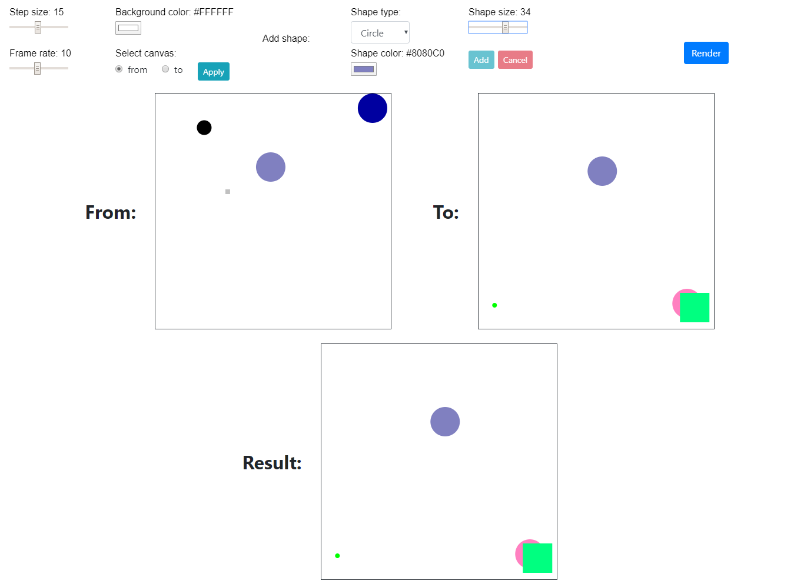

# Project 6 - Logo Designer

[Web preview](https://editor.p5js.org/kimih12/full/z9EbIQh3X)
([https://editor.p5js.org/kimih12/full/z9EbIQh3X](https://editor.p5js.org/kimih12/full/z9EbIQh3X))

## Student information

---

- Name: Inho Kim
- Major: Computer Science and Engineering
- ID: 20161577

## Application design

---

UI controls are above, with the 'from' and 'to' canvas below it. The resulting animation will be shown in the 'Result' canvas.

### Title

> Live logo

### Target users

This application is intended for users who want to create dynamic logos, taking advantage of the web platform.

### Features

- Background transition

If the background between the 'From' and 'To' canvas are different, the 'Result' canvas will have the transition of background.

- Shape transition

The shapes within both canvases will transition accordingly.

- Frame rate and transition step

You may control the transition's frame rate and step size.

### Visual concepts

This logo designer was inspired by old animating techniques, where you would draw few frames and transition between them. You can use the 'from' and 'to' canvas to do a similar animation. Register various shapes of different types, colors and positions to create animations.

### Algorithm

The 'Add' button will add shapes to the canvas, recording the coordinates, fill color and size. When 'Render' button is pressed, the difference in between will be calculated and drawn according to step size.

