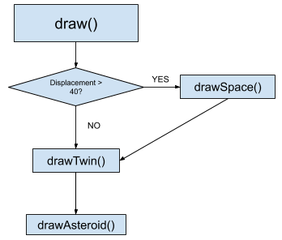

# Project 7 - Invent Your Own Brush

[Web preview](https://editor.p5js.org/kimih12/full/SZ6ZHr6sg)
([https://editor.p5js.org/kimih12/full/SZ6ZHr6sg](https://editor.p5js.org/kimih12/full/SZ6ZHr6sg))

## Student information

---

- Name: Inho Kim
- Major: Computer Science and Engineering
- ID: 20161577

## Application design

---

### Title

> The twin asteroids

### Target users

Designed for children who like space and celestial objects.

### Features

- Asteroid movement

Move your mouse over the canvas to move the red asteroid. The blue twin asteroid will follow the red asteroid.

- Background change

When moved the asteroid fast enough, the background will change, clearing the paths of the asteroids.

### Visual concepts

You may create drawing with the asteroids.

### Algorithm

