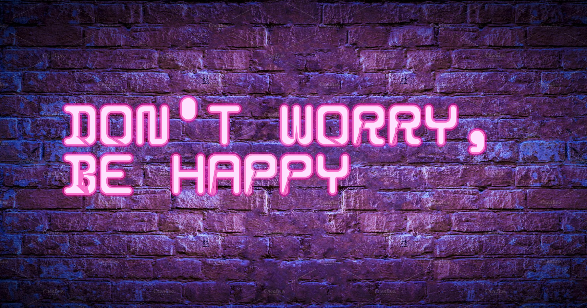
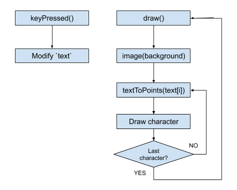

# Project 8 - Typography Art

[Web preview](https://editor.p5js.org/kimih12/present/1Et_868Ua)
([https://editor.p5js.org/kimih12/present/1Et_868Ua](https://editor.p5js.org/kimih12/present/1Et_868Ua))
[Code](https://editor.p5js.org/kimih12/sketches/1Et_868Ua)

## Student information

---

- Name: Inho Kim
- Major: Computer Science and Engineering
- ID: 20161577

## Application design

---

### Title

> Neonize it

### Target users

This application is targeted for people who like the look and feel of neon signs. People can express their own message, quote or phrase as neon signs.

### Features

- Cutomizable message

You can customize the message of the neon sign by typing with the keyboard. It accepts all alphabet characters, numbers, spaces and some special characters (?!',.). You can delete a character with the BACKSPACE key.

- Flickering neon sign

Each letter of the neon sign randomly flickers, giving a more natural look of neon signs.

- Save the neon sign

Press the ENTER key to save the neon sign of your message as an image on your computer.

- Clear the message

Press the DELETE key to clear the message.

### Visual concepts

This work is inspired by the typical neon signs you can find on brick walls at bars or cafe's. There are a unique look and a special feeling that the neon signs have, which create an atmosphere that goes well with the message expressed by the neon sign.

### Algorithm

